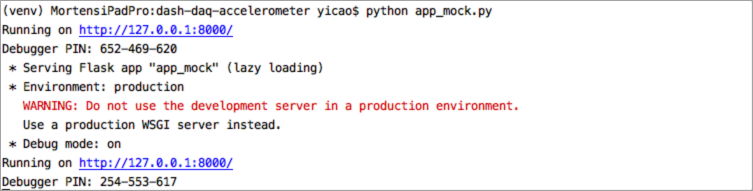

# Dash DAQ Accelerometer

## Introduction
A dash application which facilitates the controlling of Phidgets 1041_B Accelerometer. Try out [this app](https://dash-gallery.plotly.host/dash-daq-accelerometer) and learn more about this application from our [blog entry](https://www.dashdaq.io/read-data-from-a-phidgets-accelerometer).

### Phidgets accelerometer
The Phidgets Spatial is a 3-axis accelerometer that :
- Track whether an object is moving, and in which direction (x, y, z)
- Detect the presence of nearby movement or vibration
- Track the orientation of a stationary object relative to the earth's gravitational pull

The 1041 device can measure ±8 g's (±78 m/s2) per axis. It could be connected to your computer via USB and programmatically tracked. Phidgets provide resourceful [API](https://www.phidgets.com/?view=api) for programmers.

### Dash-daq
[Dash DAQ](http://dash-daq.netlify.com/#about) is a data acquisition and control package built on top of Plotly's [Dash](https://plot.ly/products/dash/). It comprises a robust set of controls that make it simpler to integrate data acquisition and controls into your Dash applications.

## Requirements
We suggest you to create a virtual environment for python3 to run this app. To do so, run:
```
python3 -m virtualenv [your environment name]
```
```
source activate [your environment name]
```

To install all of this app-specific required packages to this environment, simply run:

```
pip install -r requirements.txt
```

## How to run mock app
To run mock app, simply run in command line(or Terminal for Linux/MacOS) like:

```
python app_mock.py
```

And you will see the following prompt:



Open the web address in your browser:  


You will see the control panel of the accelerometer, with your device information displayed at the top. The app is ready-to-use.

### Controls
* Connection Toggle: Disconnect and connect to the device, indicator will light up when Dash DAQ is connected to the device.
* Change interval: Adjust acceleration change interval by dragging the sliders, value will be reflected by LED display accordingly.
* Data interval: Adjust acceleration data interval by dragging the sliders, value will be reflected by LED display accordingly.

The measured data detected on x, y and z axes is gathered from the device, and will be displayed on the gauges.


## Resources

### The Phidgets device

Technical details about Phidgets 1041_B could be found in [**Phidget User Guide**](https://www.phidgets.com/?tier=3&catid=10&pcid=8&prodid=1022).

### Dash
Dash abstracts away all of the technologies and protocols required to build an interactive web-based application, and is a simple and effective way to bind a user interface around your Python code. To learn more about Dash, check out our [documentation](https://dash.plot.ly/).
